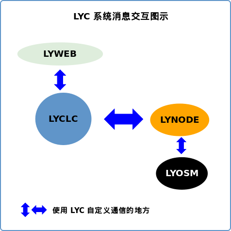
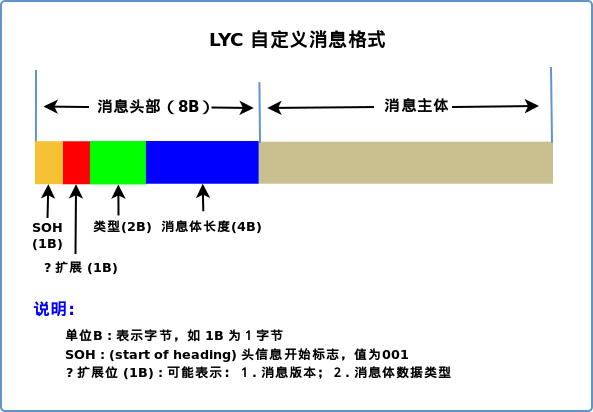

=====================
LYC 自定义通信机制
=====================

如图所示，LuoYunCloud 平台中，在多处都使用了自定义的通信机制：

消息格式
----------

LuoYunCloud 中自定义消息格式如图所示：

消息之间的格式如图：

.. image:: images/lyc_message_interspace.png

几个 ASCII 特殊字符

====  ======  ======
值    缩写     含义
====  ======  ======
000   NUL     (null)
001   SOH     (start of heading)
002   STX     (start of text)
003   ETX     (end of text)
004   EOT     (end of transmission)
====  ======  ======

消息通信基本流程设计
~~~~~~~~~~~~~~~~~~~~~~~~~

- clc listen 模式

  1. client 连进来 header 中 type 值为 0 时，表示是第一次连进来，可以获
     得 type 映射表 ( **注意** 如果 clc 需要认证，还是需要提供认证信息
     的 ) .

  2. 以后 client 有新请求都会根据 type 映射表，设置 type 值， clc 根据
     这个值决定使用哪个 handler 来处理.

- web, node 等的主动连接形式

  1. 第一次主动连接时可以发送自己的 type 映射表

  2. 也可以让 clc 主动以 type 字段为 0 的 header 消息请求 type 映射表

type 映射表示例::

  /node/status  10001
  /node/find_domain  10002
  /web/run_job   10003
  ...

- 新连接的消息体格式 (JSON ?)::

  { 'from': 'node', # node/web/api ...
    'to': 'clc',
	其他信息(如认证) }

  

消息类型(4B)
~~~~~~~~~~~~~~~~

================ ======
N/A              含义
================ ======
NODE             NODE 注册
NODE             NODE 消息
CLC              CLC 消息
WEB              WEB 消息
================ ======

消息体数据类型(1B)
~~~~~~~~~~~~~~~~~~~~~~

JSON
  使用 JSON 格式

JSON_GZIP
  gzip 压缩后的 JSON 格式

XML
  XML 格式

XML_GZIP
  gzip 压缩后的 XML 格式

